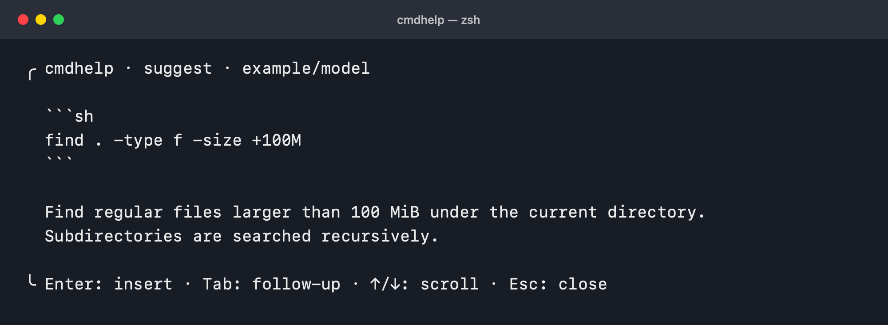

# cmdhelp

Command suggestions and explanations, one shortcut away in zsh or PowerShell.

Describe what you want to do, inspect the suggestion, and insert it into your shell prompt. Or paste a command and ask what it means. Responses stream into a small terminal panel, with follow-up questions and cancellation.

cmdhelp uses Pi's model API directly. It does not launch a coding agent or execute generated commands.



*The actual panel rendered with an example response. Press Enter to insert the suggestion into your shell prompt for editing.*

## Install

Requires [Bun](https://bun.sh/docs/installation) 1.4+ and either zsh on macOS/Linux or PowerShell 7.4+ with PSReadLine on Windows/macOS/Linux.

```sh
bun add -g @abzy128/cmdhelp
```

Make sure Bun's executable directory (normally `~/.bun/bin`) is on `PATH`. Add this line to your zsh configuration, after other shell plugins:

```zsh
eval "$(cmdhelp init zsh)"
```

Run the same line in your current shell to enable the shortcuts immediately. Configure a provider and model before making your first request.

For PowerShell, add this to `$PROFILE` and run it in your current session:

```powershell
cmdhelp init powershell | Out-String | Invoke-Expression
```

The init command loads the installed integration script. Suggestions are always inserted as literal text. See the [Windows setup instructions](docs/installation.md#enable-powershell-shortcuts) for profile creation and key bindings.

**[Installation guide](docs/installation.md)** · **[Configuration guide](docs/configuration.md)**

You can also install with `npm install -g @abzy128/cmdhelp`; Bun must still be installed and available on `PATH`.

## Use

| Shortcut | Action |
| --- | --- |
| Ctrl-X, Ctrl-G | Describe the command you need |
| Ctrl-X, Ctrl-E | Explain the current shell input |
| Enter | Submit a prompt, or insert a completed suggestion |
| Tab | Ask a follow-up after an answer |
| Up / Down | Scroll the answer |
| Escape / Ctrl-C | Cancel and restore the original input |

The launch shortcuts are sequences: press Ctrl-X, then Ctrl-G or Ctrl-E. Suggestions are inserted for editing; running them requires a separate Enter at the shell prompt.

```sh
cmdhelp suggest 'find files larger than 100 MiB'
cmdhelp explain 'git reset --soft HEAD~1'
cmdhelp explain < command.txt
cmdhelp doctor
```

Quote command arguments literally to prevent your shell from expanding `$()`, backticks, pipes, or redirections. Pipe command text on stdin when quoting is inconvenient.

PowerShell uses `Get-Content -Raw command.txt | cmdhelp explain` instead of `< command.txt`. The shell integrations select the correct syntax for model requests. Without integration, the CLI defaults to PowerShell on Windows and zsh elsewhere; use `--shell powershell` or `--shell zsh` to override it.

## Configuration

The default file is `~/.config/cmdhelp/config.json`, or `$XDG_CONFIG_HOME/cmdhelp/config.json`.

If Pi already has a default provider/model and saved credentials, cmdhelp uses them. Its default profile is `~/.pi/agent`; reasoning defaults to `off` independently of Pi's setting.

```json
{
  "reasoning": "low",
  "timeoutMs": 30000
}
```

You can also select a provider/model explicitly, use a custom Pi profile, or authenticate with a provider API-key environment variable. See the [configuration guide](docs/configuration.md) for examples and precedence.

## Data and behavior

Requests include your prompt, current shell input when using a widget, OS/shell identity, and recent follow-ups within the panel. cmdhelp does not send project files, shell history, or an environment dump as prompt context. Conversations are not saved. Temporary shell handoff files are private and removed when the widget exits normally or is cancelled.

Credentials remain in Pi's auth file; OAuth refresh may update them. Built-in Pi providers and cached catalogs are supported. Custom `models.json` providers and extension-defined providers are not loaded. Generated commands remain suggestions and can be incorrect.

## Development

```sh
bun install --frozen-lockfile
bun run check
bun test
zsh -n shell/cmdhelp.zsh
```

Run `bun run start --help` during development. See [installation](docs/installation.md#verification) for the pseudo-terminal integration check.

Run `bun run test:package` to pack and install the npm tarball in a temporary directory (requires npm and registry access). See [publishing](docs/publishing.md) for npm setup and releases.
